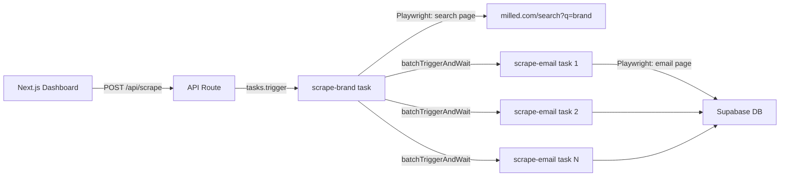

# Milled.com Email Campaign Scraper

## Architecture




## Database Schema (Supabase)

Two tables in Supabase:

- `**scrape_jobs**`: `id` (uuid, PK), `brand_name` (text), `status` (text: pending/running/completed/failed), `total_emails` (int), `scraped_emails` (int), `created_at` (timestamptz)
- `**emails**`: `id` (uuid, PK), `job_id` (uuid, FK), `brand_name` (text), `email_url` (text, unique), `email_subject` (text), `email_html` (text), `scraped_at` (timestamptz)

These will be created via SQL in the Supabase dashboard (manual step documented in README).

## Files to Create / Modify

### 1. Dependencies

Add to [package.json](package.json):

- `playwright` - browser automation
- `@supabase/supabase-js` - database client
- `@trigger.dev/build` already present as devDep

### 2. Trigger.dev Config - [trigger.config.ts](trigger.config.ts)

Add the Playwright build extension:

```typescript
import { playwright } from "@trigger.dev/build/extensions/playwright";

export default defineConfig({
  // ...existing config
  build: {
    extensions: [playwright()],
  },
});
```

### 3. Playwright Browser Middleware - `trigger/playwright-browser.ts` (new)

Following the official Trigger.dev pattern:

- Use `locals` to store browser instance
- `tasks.middleware` to launch/close browser around each task run
- `tasks.onWait` / `tasks.onResume` for graceful browser lifecycle
- Anti-bot stealth config: custom User-Agent, disabled `webdriver` flag, realistic viewport

### 4. Parent Task - `trigger/scrape-brand.ts` (new)

- Receives `{ brandName: string, jobId: string }`
- Updates job status to `running` in Supabase
- Launches Playwright, navigates to `https://milled.com/search?q={brandName}`
- Waits for page load with random human-like delay (2-5s)
- Extracts all email campaign links from `<li>` elements' `<a>` tags
- Updates `total_emails` count in `scrape_jobs`
- Uses `batchTriggerAndWait` on the child `scrape-email` task for all links
- Updates job status to `completed` when done

### 5. Child Task - `trigger/scrape-email.ts` (new)

- Receives `{ emailUrl: string, brandName: string, jobId: string }`
- Launches Playwright (via middleware), navigates to the email URL
- Random delay before scraping (1-4s)
- Extracts `div#emailcell` outer HTML (note: this div uses Shadow DOM with `<template shadowrootmode="open">`, so we use `element.innerHTML` or `element.evaluate()` to get the full content including the shadow root template)
- Extracts email subject from page title or meta
- Inserts into Supabase `emails` table
- Increments `scraped_emails` count on the parent job

### 6. Supabase Client - `lib/supabase.ts` (new)

- Creates and exports a Supabase client using env vars `SUPABASE_URL` and `SUPABASE_SERVICE_ROLE_KEY`
- Helper functions: `createJob()`, `updateJob()`, `insertEmail()`, `getJobs()`, `getEmailsByJob()`

### 7. API Route - `app/api/scrape/route.ts` (new)

- `POST`: Accepts `{ brandName }`, creates a job in Supabase, triggers the `scrape-brand` task, returns job ID
- `GET`: Returns list of all jobs with their statuses

### 8. Dashboard UI - [app/page.tsx](app/page.tsx) (replace default content)

- Clean, modern UI with Tailwind CSS
- Input field for brand name + "Start Scraping" button
- Jobs list showing: brand name, status (with color badges), email count, timestamp
- Click a job to expand and see scraped emails
- Auto-refresh to poll job status

### 9. Environment Variables

Create `.env.local` (gitignored) with:

- `SUPABASE_URL`
- `SUPABASE_SERVICE_ROLE_KEY`
- `TRIGGER_SECRET_KEY` (already needed for Trigger.dev)

## Anti-Bot Detection Strategy

Applied in both parent and child tasks:

- **Stealth launch args**: `--disable-blink-features=AutomationControlled`, no `webdriver` flag
- **Realistic User-Agent**: Rotate between 3-5 modern Chrome UA strings
- **Random delays**: `2000-5000ms` between page loads, `1000-3000ms` before extracting content
- **Human-like viewport**: `1920x1080` with realistic `deviceScaleFactor`
- **Sequential child processing**: Use `batchTriggerAndWait` which Trigger.dev handles with concurrency queues, not simultaneous browser instances
- **Concurrency limit**: Set queue concurrency on child task to `2-3` max to avoid hammering the site

## Dev Workflow

1. Set up Supabase project and create tables (SQL provided)
2. Add env vars to `.env.local`
3. `npm install` new deps
4. `npx trigger dev` to start Trigger.dev dev server
5. `npm run dev` to start Next.js
6. Enter a brand name in the dashboard and hit scrape

