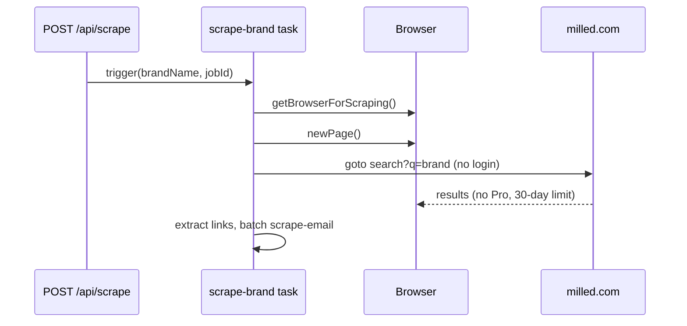
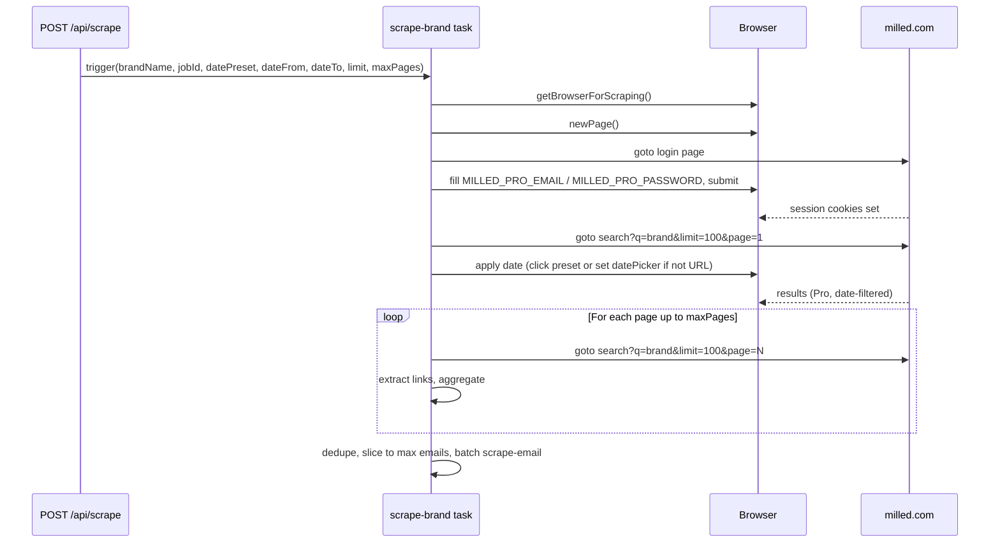

# Milled Pro: date range, pagination, and logged-in session

## Current flow (simplified)

Today: one page of search, no login, no date filter, no pagination.

## Target flow

Session handling: **one browser, one context**. Log in on the first page, then all subsequent `page.goto(search...)` use the same cookies. No “passing” session to another browser; the same page (or same browser context) holds the session.

---

## 1. Environment and config

- **Env (e.g. in [.env.example](.env.example))**
  - `MILLED_PRO_EMAIL` – Milled Pro account email
  - `MILLED_PRO_PASSWORD` – Milled Pro account password  
  Task reads these and uses them only when present; if missing, skip login (current behavior).
- **Constants** (e.g. in [lib/constants.ts](lib/constants.ts) or trigger)
  - Search: `limit=100` (max per page), default `maxPages` (e.g. 10) to cap how many pages we fetch.

---

## 2. Dashboard: date range and options

- **Scrape form** ([components/ScrapeForm.tsx](components/ScrapeForm.tsx))
  - Add:
    - **Date preset** dropdown: e.g. “Default (no filter)”, “Last 7 days”, “Last 12 months”, “Last 24 months”, “All time” (map to Milled’s `data-preset-name` or internal enum).
    - Optional **Custom range**: two date inputs (from / to) or a single “custom” option that shows them; send `dateFrom`, `dateTo` (ISO date strings).
  - Keep existing **Brand name** and **Start scraping**.
- **State and API**
  - [app/page.tsx](app/page.tsx): state for `datePreset`, `dateFrom`, `dateTo`; pass into `handleStartScrape`.
  - **POST body** from dashboard: `brandName`, `datePreset?`, `dateFrom?`, `dateTo?`, `limit?` (default 100), `maxPages?` (default e.g. 10).

---

## 3. API and task payload

- **[app/api/scrape/route.ts](app/api/scrape/route.ts)**
  - Parse `datePreset`, `dateFrom`, `dateTo`, `limit`, `maxPages` from body.
  - Pass them through to `tasks.trigger("scrape-brand", { brandName, jobId, datePreset?, dateFrom?, dateTo?, limit?, maxPages? })`.
- **Job storage**
  - Optional: store `date_preset` / `date_from` / `date_to` in DB (new columns on `scrape_jobs`) for display in the UI. If you prefer minimal change, these can stay only in the trigger payload and not in DB.
- **Trigger payload** ([trigger/scrape-brand.ts](trigger/scrape-brand.ts))
  - Extend `ScrapeBrandPayload` with optional `datePreset?: string`, `dateFrom?: string`, `dateTo?: string`, `limit?: number`, `maxPages?: number`.

---

## 4. Milled login (same browser, same context)

- **When** `MILLED_PRO_EMAIL` and `MILLED_PRO_PASSWORD` are set, at the start of the task:
  1. Create browser and page as today.
  2. Navigate to Milled login URL (e.g. `https://milled.com/login` or `/users/sign_in` – confirm on live site).
  3. Fill email and password (selectors to be confirmed on live page: e.g. `input[name="email"]`, `input[name="password"]` or `#user_email`, `#user_password`).
  4. Submit form (click submit or `form.submit()`), wait for navigation (e.g. `waitForURL` or wait for a post-login selector).
  5. Optional: check for login failure (e.g. error message on page) and fail the task with a clear log.
  6. Then proceed to search. All subsequent `page.goto(search...)` use the same page (and thus same cookies/storage).
- **When** Pro env vars are not set: skip login and keep current behavior (no Pro features).
- **Implementation place**: [trigger/scrape-brand.ts](trigger/scrape-brand.ts) (or a small helper e.g. `trigger/milled-login.ts`) so a single function “ensureLoggedIn(page)” runs right after `browser.newPage()` and before the first `page.goto(searchUrl)`.

---

## 5. Search URL and pagination

- **Build search URL** in [trigger/scrape-brand.ts](trigger/scrape-brand.ts):
  - Base: `https://milled.com/search?q=${encodeURIComponent(brandName).replace(/%20/g, '+')}` (existing).
  - Append `&limit=100` (or `limit` from payload, capped at 100).
  - For page N: `&page=N` (N ≥ 1).
- **First page**
  - Goto `search?q=...&limit=100&page=1`.
  - After load (and after applying date if done in-page), parse total results from the “Emails (993 results)” block: e.g. `div containing "Emails" and (N) results` with regex or DOM to get N. Then `totalPages = Math.ceil(N / 100)` (or use `limit` from payload).
- **Date on first load**
  - If Milled supports date in URL (e.g. `&from=...&to=...`), add those from `dateFrom`/`dateTo` when present.
  - If date is only in-page: after first search load, either:
    - Click preset: `await page.click('button[data-preset-name="last12Months"]')` (or map `datePreset` from payload to the right `data-preset-name`), then wait for results to update (e.g. wait for network idle or for the “(N results)” text to change); or
    - Set custom range: set `#datePicker`’s value / `data-dates` and trigger “Apply” (exact selectors from live page). Then wait for list update.
  - Log which date filter was applied for the run view.

---

## 6. Multi-page aggregation

- **Loop** from page 1 to `min(maxPages, totalPages)`:
  - Goto `search?q=...&limit=100&page=N`.
  - Wait for list ready (same selector as today: `li a[data-turbo-frame="_top"]` or the container).
  - Run the same `page.evaluate` link extraction as today, append to a single array (with dedupe by URL).
- **Cap**
  - Either cap by `maxPages` only, or by total emails (e.g. stop when aggregated links length ≥ desired max). Then slice to `MAX_EMAILS_TO_SCRAPE` (or a job-level max) and trigger `scrapeEmailTask.batchTriggerAndWait` as today.

---

## 7. Total results and logging

- Reuse the “(993 results)” block: from the first page (after date filter if applied), read the total and log it (e.g. “Emails (993 results)”) and send to `sendJobLog` so the UI shows it. Use a small `page.evaluate` that returns that number (e.g. regex on the text in the div you identified).

---

## 8. Files to touch (summary)

| Area                     | Files                                                                                                                                  |
| ------------------------ | -------------------------------------------------------------------------------------------------------------------------------------- |
| Env / constants          | [.env.example](.env.example), optionally [lib/constants.ts](lib/constants.ts)                                                          |
| Dashboard form           | [components/ScrapeForm.tsx](components/ScrapeForm.tsx) (date preset + optional custom from/to)                                         |
| Dashboard state / submit | [app/page.tsx](app/page.tsx) (state, pass options to API)                                                                              |
| API                      | [app/api/scrape/route.ts](app/api/scrape/route.ts) (body parsing, pass payload to trigger)                                             |
| Task payload / types     | [trigger/scrape-brand.ts](trigger/scrape-brand.ts) (payload type, login step, URL builder, date apply, pagination loop, total parsing) |
| Optional DB/type         | [lib/types.ts](lib/types.ts), [lib/supabase.ts](lib/supabase.ts), migration if you store date options on the job                       |

---

## 9. Session “passed into new browser”

- There is no separate “new” browser: the same browser (and usually the same page) is used for login and then for every search request. So the “logged session” is simply the cookies (and any local/session storage) set by the login response; they are automatically sent on every subsequent `page.goto` to milled.com. No cookie export/import or second browser is required. If you later need to reuse the same session across multiple job runs (e.g. one login per worker), that would be a separate step (e.g. persist cookies to storage and inject them in a new browser context); for this plan, “login once at the start of the task, then scrape with that context” is sufficient.

---

## 10. Order of implementation

1. Env vars and payload types (task + API + dashboard state).
2. Login step in the task (when Pro env set); confirm login URL and selectors on milled.com.
3. Search URL with `&limit=100` and `&page=N`; first page only, then add pagination loop and total-result parsing.
4. Apply date range (preset click or date picker) after first load if not in URL.
5. Dashboard form and API wiring for date preset and optional custom range.

